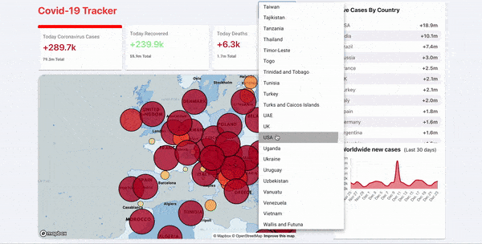

<p align="center">

</p>

<p align="center">
  Here's where tha data comes from <a href="https://disease.sh/docs/#/">API</a>.
</p>

## Setup

### Install packages :

```bash

npm install

# or

yarn install

```

### Run Development server with hot-reloading:

```bash

npm run dev

# or

yarn dev

#or

// if you have now CLI

now dev

```

Open [http://localhost:3000](http://localhost:3000) with your browser to see the result.

You can start editing the page by modifying `pages/index.js`. The page auto-updates as you edit the file.
